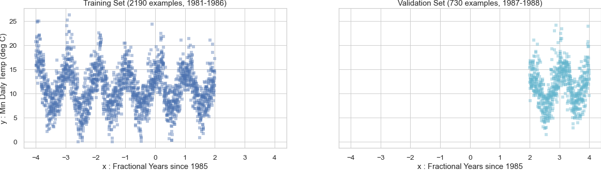

This dataset describes the minimum daily temperatures over 10 years (1981-1990) in the city Melbourne, Australia.

The units are in degrees Celsius and there are 3650 observations. The source of the data is credited as the Australian Bureau of Meteorology.

MCH originally found this data here:
https://machinelearningmastery.com/time-series-datasets-for-machine-learning/
and prepared two kinds of splits, a "ByYear" split and a "ByRandom" split.
